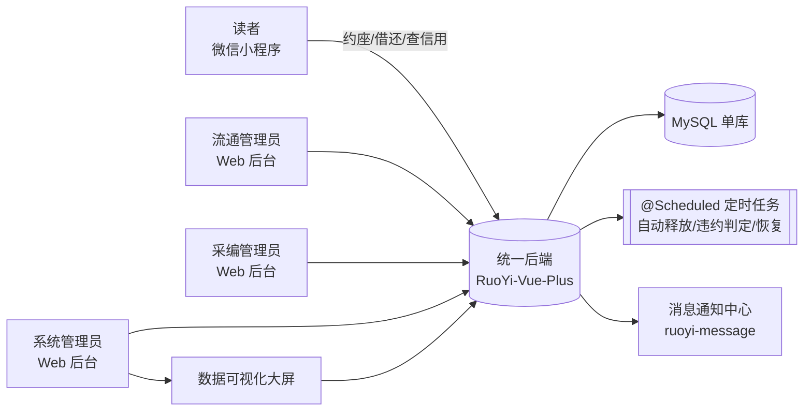

# 需求规格说明书（SRS）· 高校图书馆预约系统

> 本文是 SOP 主线 **01 需求** 阶段的唯一产出，是后续 **02 数据库设计** 与 **03 开发** 的直接依据。**本阶段只出文档，不碰数据库表、不写业务代码。**
> 全部素材来自需求调研笔记（联网检索为主，见 [§7 参考资料](#sec-ref)）。凡真实图书馆里涉及"罚款 / 滞纳金 / 赔款"的环节，本项目一律改写为 **记录 + 信用扣分 + 暂停权限**，归还 / 核销 / 申诉后恢复——**本系统无金额、不做支付**。

---

## 1 引言

### 1.1 目的

为"高校图书馆座位/自习室预约 + 图书借阅"一体化系统定义完整、可闭环、可追溯的功能与约束需求，作为数据库设计与编码开发的基准。读者端为**微信小程序**，管理端为 **RuoYi-Vue-Plus Web 后台**，两端共用同一后端与数据库。

### 1.2 范围

**纳入范围**（两大业务模块 + 三大亮点 + 支撑模块）：

- **模块 A · 座位/空间预约**：场馆→楼层→区域→座位（带坐标）四级建模、平面图可视化选座、时段预约、签到/暂离/续座/退座、占座监督、研讨间（空间）整间预约、超时自动释放。
- **模块 B · 图书借阅/流通**：采编入库（荐购→验收→编目→加工→典藏→上架）、OPAC 检索、借出/归还/续借、预约到书（hold）与预约架保留、预约催还、逾期/遗失（记录+扣分，不涉款）、剔旧/报损/核销下架。
- **亮点①** 可视化平面图选座（座位坐标 + 实时状态着色）。
- **亮点②** 信用分体系 + 黑名单，配 Spring `@Scheduled` 定时任务自动做违约判定与资源自动释放。
- **亮点③** 数据可视化大屏（座位/图书/信用三线实时指标）。
- **支撑**：消息通知中心（复用基座 `ruoyi-message` 能力）、系统配置与角色权限、个人中心。

**排除范围**（明确不做，避免范围蔓延）：

- 不做任何**支付/收费/钱包**（逾期、遗失、损坏均只记录+扣分+暂停权限）。
- 不做与学校"统一身份认证（CAS/OAuth）""一卡通/门禁闸机""RFID/自助借还机""墨水屏桌签"的**真实硬件对接**；这些在系统内用**扫码/管理员代办**模拟（如"扫码签到"= 小程序扫座位二维码，"门禁签退"= 小程序点"退座"或管理员代操作）。
- 不做**馆际互借、跨校区真实结算等跨馆业务**；系统按**单馆**建模（数据层预留多场馆/藏地字段，"通借通还"等多馆特性不在本期范围）。
- 不做电子图书全文阅读、参考咨询。读者端"新书通报 / 热门推荐 / 教参推荐"等增值内容位为**可选增强，本期不作为需求项**（不影响两大模块闭环）。

### 1.3 术语表（Glossary）

正文的菜单名、字段名、状态名一律用下列业务词（英文/原码保留），不意译成技术黑话。完整版见调研笔记术语表。

| 术语 | 英文/缩写 | 释义 |
|---|---|---|
| 书目（种） | Bib | 一条书目记录（同一种书，一个 ISBN/版本） |
| 馆藏（册） | Item | 一个带**条码（Barcode）**的物理副本，是可借的最小实体；一"种"含多"册"（复本 Copy） |
| ISBN | International Standard Book Number | 国际标准书号，采编查重主键之一 |
| 中图法分类号 | CLC | 《中国图书馆分类法》类号，决定学科位置 |
| 索书号 | Call Number | 排架/查找依据 = 分类号 + 著者号；贴于书脊 |
| 采编 | Acquisition & Cataloging | 采访（荐购/订购/验收登到）+ 编目（分类著录赋索书号）+ 典藏（藏地分配/加工） |
| 流通 | Circulation | 借出、归还、续借、预约、催还等面向读者的借阅业务 |
| OPAC | Online Public Access Catalog | 联机公共书目检索系统，读者端检索 + 自助服务入口 |
| 预约到书 / hold | Hold | 目标书全部借出时读者排队预约，归还回馆后为其保留 |
| 预约架 | Hold Shelf | 到馆预约书暂存架，保留 N 天供取（本项目取 **5 天**，可配置） |
| 预约催还 | Recall | 在借图书被他人预约，系统催持书人提前归还 |
| 签到 / 签退 | Check-in / Check-out | 座位到场确认 / 使用结束释放 |
| 暂离中 | Away | 座位使用中临时离开并保留座位（限时，超时释放） |
| 监督 | Supervise | 他人举报"占而无人"，触发原用户限时落座否则释放 |
| 爽约 | No-show | 预约成功但弹性窗内未签到，视为违约 |
| 信用分 | Credit Score | 读者守信度量化值（0–100），低于阈值限制预约/借阅或进黑名单 |
| 信用流水 | Credit Log | 每一次信用变动的带符号记账条目（delta + 事由），信用分 = 全部流水之和 |
| 黑名单 | Blacklist | 违约超阈值被暂停预约/借阅权限的名单 |
| 研讨间 | Group Study Room | 供小组讨论的封闭房间，按"空间预约"整间预约 |
| 剔旧 | Weeding | 剔除陈旧/破损/超复本文献 |
| 报损/注销/核销 | Withdrawal | 破损遗失文献的报废及目录系统注销登记 |

### 1.4 参考资料

见 [§7 参考资料](#sec-ref)（对标产品与来源链接）。调研全文：`docs/specs/research-notes-library.md`（项目仓库）。

---

## 2 系统概述

### 2.1 系统上下文

### 2.2 主要功能一览

| 业务域 | 核心功能 |
|---|---|
| 座位/空间预约 | 平面图选座、时段预约、签到/暂离/续座/退座、取消、监督、研讨间预约、超时自动释放 |
| 图书流通（读者侧） | OPAC 检索、借阅查询、自助续借、图书预约(hold)、取书、荐购、到书/催还/到期通知 |
| 图书流通（管理侧） | 借出/归还办理、预约到书上架、预约催还、逾期/遗失登记、违约处理与申诉审批 |
| 采编馆藏 | 荐购受理、验收登到、编目(赋索书号)、复本管理、上下架、剔旧/报损/核销 |
| 信用与黑名单 | 违约记录、信用扣分/加分、时间衰减恢复、黑名单进出、违约申诉 |
| 系统配置 | 场馆/楼层/区域/座位/研讨间维护、时段与规则参数、信用规则、角色权限、定时任务参数 |
| 数据可视化大屏 | 座位/图书/信用三线实时指标 |
| 消息通知中心 | 站内信/模板消息：到书、催还、到期、被监督、审批结果、违约、申诉结果、公告 |

### 2.3 角色列表（4 个，含 C 端角色） {#sec-roles}

| 角色 | 标识 | 端 | 一句话定位 |
|---|---|---|---|
| **读者** | `reader` | 微信小程序（C 端） | 系统绝大多数业务的发起方与守信执行者：自助约座、借还查询、荐购、查信用、申诉 |
| **流通管理员** | `circ_admin` | Web 后台 | 借还与违约处理的执行/收尾方：办理借出归还、上架预约架、催还、处理违约与申诉、维护黑名单 |
| **采编管理员** | `cat_admin` | Web 后台 | 馆藏的发起（入库）与收尾（注销）方：荐购受理、验收编目、复本管理、上下架、剔旧核销 |
| **系统管理员** | `sys_admin` | Web 后台 | 规则与平台的配置方：场馆座位/时段/信用规则/权限/定时任务参数配置、数据可视化大屏；不介入单笔业务、不看读者个人明细 |

> 角色粒度控制在 4 个，覆盖"发起→审批→执行→收尾"全链路，且 C 端读者角色的自助功能在 [§3.1 读者](#sec-reader) 单列并逐条列全。

### 2.4 假设、依赖与约束

- **假设**：读者以校园卡号/学号 + 密码登录（系统内自建账号模拟统一认证，不做真实 CAS 对接）；每读者绑定唯一学号完成实名。
- **依赖**：MySQL（本机原生，一库一项目）、Redis、MinIO（图片：平面图底图、图书封面、大屏截图）；消息通知复用基座 `ruoyi-message`；C 端接入复用基座 `ruoyi-app`；读者账号/档案复用基座用户管理。
- **约束**：见 [§6 非功能需求](#sec-nfr) 与各业务的时段/次数/阈值取值表（§3 内联）。所有取值以**系统参数**形式可配置（系统管理员维护），不硬编码。

---

## 3 功能清单（按角色分组）

> 勾选框表示"需实现的功能点"，非"已完成"。每条可追溯到调研笔记中的真实场景。

### 3.1 读者（reader · 微信小程序 C 端） {#sec-reader}

**账号与个人中心**

- [ ] 登录与实名绑定：校园卡号/学号 + 密码登录，首次绑定学号/姓名/院系完成实名。
- [ ] 个人中心：查看我的信用分与等级、违约记录、履约（守信）次数、当前黑名单状态与解除时间。
- [ ] 我的预约：**座位预约**记录（待签到/使用中/暂离中/已完成/已取消/已违约）与**研讨间预约**记录（待审批/已通过/已驳回/使用中/已完成/已取消/已违约）分状态查询。
- [ ] 我的借阅：在借清单（含应还日、是否被预约催还）、借阅历史、我的图书预约(hold)队列位次、**预约到书待取清单（含保留期倒计时）**。
- [ ] 消息通知：接收并查看到书、催还、到期提醒、**座位被监督提醒（含落座倒计时）**、**研讨间审批结果**、违约通知、申诉结果、公告（站内信 + 模板消息）。

**座位/空间预约（亮点①入口）**

- [ ] 平面图选座：进场馆→选楼层→看该层各区域**平面图**，座位按状态实时着色（可选[空]/已约/使用中/暂离/不可用），点座位选时段下单（**下单前校验黑名单禁约、信用阈值限次/仅当日**）。
- [ ] 快速选座：设筛选条件（楼层/区域/是否靠窗/有无插座）由系统自动分配一个空座（同样受黑名单/信用阈值前置校验）。
- [ ] 现场扫码选座：扫桌面二维码，当前时段直接落座、未来时段仍需签到。
- [ ] 取消预约：次日座位次日约定时间前可取消；当日座位每日限一次取消（阈值可配）。
- [ ] 签到：到起始时间前后弹性窗内扫座位二维码签到（弹性窗默认 ±20 分钟，可配）。
- [ ] 暂离 / 返回落座：使用中点"暂离"（默认保护 20 分钟），返回时扫码落座解除暂离中。
- [ ] 被监督落座：收到"座位被监督提醒"后，在倒计时内扫码落座即解除监督（详见 [§5.1](#sec-loop)）。
- [ ] 续座：结束前申请延长时段（后续时段空闲才可）。
- [ ] 退座/签退：主动结束释放座位；离馆视为签退。
- [ ] 研讨间（空间）预约：整间预约（提前 N 天、每日限 1 次、可配最少人数；受黑名单/信用前置校验）；支持取消；若该研讨间配了"需审批"则提交后待管理员审批，审批结果在"我的预约"与消息中查看。
- [ ] 占座监督：对"占用但无人"的座位发起举报（暂离中状态不在监督范围）。

**图书借阅（OPAC 自助）**

- [ ] OPAC 检索：按题名/著者/主题词/ISBN/索书号/条码检索书目，查看馆藏各册**对读者展示的状态**（可借/借出/在预约架/已注销；"在编"不对读者展示）与藏地。
- [ ] 借阅查询：查看在借、借阅历史、应还日、续借次数。
- [ ] 自助续借：到期前续借（**逾期或已被他人预约的册不可续**）。
- [ ] 图书预约(hold)：某书全部复本借出时预约排队（**下单前校验黑名单/信用阈值**），查看队列位次；支持取消预约。
- [ ] 到馆取书：预约到书后在保留期（默认 5 天）内到馆，**由流通台按 hold 单办理借出**（读者侧为"到馆取书"确认与倒计时提醒，实际借出动作见 [§3.2](#sec-admins)）。
- [ ] 荐购：提交购书建议（题名/著者/ISBN/理由），查看受理进度（待受理/已受理/已驳回/已采购）。

**信用与申诉**

- [ ] 查信用分与违约明细：逐条查看违约类型、扣分、发生时间（只读，仅本人）。
- [ ] 违约申诉：对某条违约（如闭馆忘签退等非故意）提交申诉与说明，查看审批结果。

### 3.2 流通管理员（circ_admin · Web 后台） {#sec-admins}

**座位预约管理**

- [ ] 预约总览：按场馆/楼层/区域/状态查询全部座位预约单，实时占用一览。
- [ ] 人工干预：为读者代取消/强制退座/强制释放异常占用座位。
- [ ] 研讨间预约审批：审批（通过/驳回）需审批的研讨间预约申请，结果经消息中心通知读者。

**图书流通办理**

- [ ] 借出办理：扫读者码 + 图书条码办理借出（校验黑名单/信用阈值/可借册数上限/是否有逾期未还）。
- [ ] 归还办理：图书条码归还，库存回滚（该册→可借/或转入预约架给下一位）。
- [ ] 续借办理：为读者代续借（同"不可续"规则）。
- [ ] 预约到书上架 + 取书借出：将归还且有预约队列的书置于**预约架**、通知队首读者、生成保留期；读者到馆时按 hold 单办理借出。
- [ ] 预约催还：对"在借但被他人预约"的图书发起催还提醒。
- [ ] 逾期处理：查看逾期在借清单（本项目**不收滞纳金**，仅系统记录+扣分，管理员可登记催还）。
- [ ] 遗失/损坏登记：**登记**读者报失/损坏并暂停其借阅权限（**记录+扣分+暂停，不涉款**）；补书或采编核销完成后，由流通操作**恢复权限**（详见 [§5.2](#sec-loop)）。

**违约与黑名单**

- [ ] 违约记录管理：查看/新增/修正读者违约记录（座位类 + 图书类）。
- [ ] 违约申诉审批：审批读者申诉，通过则**解除该次违约并回补信用分**（写一条冲正信用流水）。
- [ ] 黑名单维护：查看黑名单、手动加入/解除、查看自动到期解除情况。

### 3.3 采编管理员（cat_admin · Web 后台）

- [ ] 荐购受理：受理读者荐购（通过转采购/驳回并回执）。
- [ ] 验收登到：新书到馆验收，登记到财产/馆藏。
- [ ] 编目：为书目录入题名/著者/ISBN/中图法分类号/出版信息，赋**索书号**；查重（同书异号/异号同书）。
- [ ] 复本与馆藏管理：为一"种"新增多"册"（复本），每册生成唯一**条码**、分配藏地。
- [ ] 上架/下架：册从"在编"置为"可借（在架）"上架；异常册下架。
- [ ] 剔旧/报损/核销：对陈旧/破损/遗失/超复本的册执行剔旧、报损，在目录系统**注销登记**为"已注销"，更新馆藏；对读者报失/报损的册完成核销后，回执流通以便恢复读者权限。

### 3.4 系统管理员（sys_admin · Web 后台）

- [ ] 场馆/楼层/区域维护：维护场馆、楼层、区域层级。
- [ ] 座位维护：维护座位（编号/类型/是否靠窗/有无插座/**平面图坐标 x,y**/状态），上传楼层平面图底图（亮点①的数据基础）。
- [ ] 研讨间维护：维护研讨间（容量/是否需审批/是否需签到/可预约时段）。
- [ ] 时段与规则参数：预约时段模板、提前预约窗口、每日可约次数、单次时长、签到弹性窗、暂离时长、签退宽限、监督响应时长、预约架保留天数、可借册数与借期、续借次数上限等（全部可配）。**释放/未签退判定以"预约结束时间"为准，闭馆前仅推送提醒**。
- [ ] 信用规则配置：初始分、各违约类型扣分、履约加分、时间衰减恢复、阈值（限制/黑名单）、黑名单暂停天数（亮点②的规则来源）。**默认值**：初始分 100、门槛分 60、`<60` 每日可约数减半、`<40` 仅可当日预约、`<20` 或单类违约累计 3 次进黑名单、暂停 7 天、无违约每满 30 天 +5、履约 +1/次。
- [ ] 定时任务参数：查看/配置各 `@Scheduled` 任务的开关与频率（见 [§3.5 定时任务](#sec-cron)）。
- [ ] 读者账号/档案管理：复用基座用户管理，维护读者建档/查询/停用（借出办理"扫读者码"依赖读者档案）。
- [ ] 角色权限管理：维护 4 角色的菜单可见与操作权限（依 [§4 角色权限矩阵](#sec-perm)）。
- [ ] 报表数据导出：预约/借阅/违约/馆藏统计报表导出（各角色仅限本职责范围数据，见 [§4](#sec-perm) 收紧说明）。
- [ ] 公告管理：发布规则/公告，经消息中心下发读者。
- [ ] **数据可视化大屏**：查看座位/图书/信用三线实时指标（亮点③，指标清单见 [§3.6 大屏指标](#sec-dashboard)）。

### 3.5 系统/定时任务（无人工触发，亮点②的自动化落地） {#sec-cron}

> 由 Spring `@Scheduled` 周期扫描执行；每类任务的动作都对应 [§5 业务闭环自检表](#sec-loop) 里某条业务的"系统收尾出口"。

- [ ] **超时未签到释放**：扫描超过签到弹性窗仍未签到的预约单 → 记违约（爽约）+ 释放座位 + 扣分。
- [ ] **暂离超时释放**：扫描暂离超过保护时长未返回的 → 记违约 + 强制退座 + 扣分。
- [ ] **监督超时释放**：被监督后限时内未落座 → 记违约 + 释放 + 扣分。
- [ ] **到期自动释放**：到达预约结束时间仍未退座 → 自动结束、释放座位（未按时签退记违约）。
- [ ] **图书逾期判定**：扫描过应还日仍未还的在借 → 置逾期 + 扣分（可按逾期天数递增）。
- [ ] **预约架超期释放**：到馆预约书超保留期未取 → 记违约 + 释放该书、顺延通知下一位。
- [ ] **信用分时间衰减恢复**：无违约满周期（默认 30 天）自动回补信用分（封顶 100，写一条信用流水）。
- [ ] **黑名单到期解除**：暂停期满自动解除黑名单并恢复至门槛分（写一条校准信用流水）。
- [ ] **通知推送**：预约到书/预约催还/到期提醒/闭馆前提醒，定时批量下发消息中心。

> 注：**履约加分**（按时签退 / 按时归还 `+1`）与**座位被监督提醒**由业务事件即时触发（写信用流水 / 发消息），不在定时扫描内。

### 3.6 数据可视化大屏指标清单（亮点③） {#sec-dashboard}

- **座位/空间线**：实时座位占用率（全馆/分楼层/分区域）、座位状态热力图（平面图叠加）、区域利用率排行、到馆签到时段趋势（24h）、当前在馆人数/空位数、研讨间使用率、预约爽约率。
- **图书/流通线**：今日借/还册数实时曲线、图书借阅排行 Top N、中图法 22 大类借阅分布、各藏地借阅量、在借总量/逾期册数/预约在途数、馆藏总量与可借/借出/在编/注销占比。
- **读者/信用线**：信用分分布直方图、黑名单人数与趋势、违约类型构成（未签到/暂离超时/监督/逾期）、活跃读者数、新增/累计注册。

> 大屏面向管理决策，仅展示**聚合/匿名**指标，不逐条暴露读者个人信用/借阅明细。

---

## 4 角色权限矩阵 {#sec-perm}

> 单元格：**可操作** = 能看到入口并能执行；**可见** = 能看到入口/数据但不能改；**无** = 连菜单都看不到。列与 [§2.3 角色列表](#sec-roles) 一一对应。读者列均指微信小程序端。

| 页面 / 功能 | 读者 | 流通管理员 | 采编管理员 | 系统管理员 |
|---|---|---|---|---|
| 平面图选座 / 约座 / 签到暂离退座 | 可操作 | 无 | 无 | 无 |
| 取消预约 / 续座 / 研讨间预约 | 可操作 | 无 | 无 | 无 |
| 占座监督（举报）/ 被监督落座 | 可操作 | 无 | 无 | 无 |
| 个人中心 / 我的预约 / 我的借阅（本人） | 可操作 | 无 | 无 | 无 |
| 消息通知中心 / 站内信 | 可操作 | 可见 | 可见 | 可操作（含公告下发） |
| OPAC 公共检索（书目/馆藏查询） | 可操作 | 可操作 | 可操作 | 可见 |
| 我的借阅查询 / 自助续借（本人） | 可操作 | 可操作（代办） | 无 | 无 |
| 图书预约(hold) / 取消 / 到馆取书 | 可操作 | 可操作 | 无 | 无 |
| 荐购提交 | 可操作 | 无 | 可见 | 无 |
| 我的信用分 / 违约明细 | 可见（仅本人） | 可见（全部读者） | 无 | 无 |
| 违约申诉（提交） | 可操作 | 无 | 无 | 无 |
| 座位预约总览 / 人工干预（强制释放） | 无 | 可操作 | 无 | 无 |
| 研讨间预约审批 | 无 | 可操作 | 无 | 无 |
| 图书借出 / 归还 / 续借办理 | 无 | 可操作 | 无 | 无 |
| 预约到书上架 / 取书借出 / 预约催还 | 无 | 可操作 | 无 | 无 |
| 逾期处理（流通） | 无 | 可操作 | 无 | 无 |
| 遗失/损坏登记（流通登记 / 采编核销） | 无 | 可操作（登记+恢复权限） | 可操作（核销） | 无 |
| 违约记录管理 / 申诉审批 / 解除违约 | 无 | 可操作 | 无 | 无 |
| 黑名单维护（加入/解除） | 无 | 可操作 | 无 | 无 |
| 荐购受理 / 验收登到 | 无 | 可见 | 可操作 | 无 |
| 编目（赋索书号）/ 复本管理 | 无 | 可见 | 可操作 | 无 |
| 上架 / 下架 | 无 | 可见 | 可操作 | 无 |
| 剔旧 / 报损 / 核销（注销） | 无 | 无 | 可操作 | 可见 |
| 场馆/楼层/区域/座位/研讨间维护 | 无 | 无 | 无 | 可操作 |
| 时段与规则参数 / 信用规则 / 定时任务参数 | 无 | 无 | 无 | 可操作 |
| 读者账号/档案管理（复用基座） | 无 | 可见 | 无 | 可操作 |
| 角色权限管理 | 无 | 无 | 无 | 可操作 |
| 操作审计日志（操作人/时间/动作，不含读者明细） | 无 | 无 | 无 | 可操作 |
| 公告管理 | 无 | 可见 | 可见 | 可操作 |
| 数据可视化大屏（聚合指标） | 无 | 可见 | 可见 | 可操作 |
| 数据导出（报表，限本职责范围） | 无 | 可操作 | 可操作 | 可操作 |

> **敏感操作收紧**：
> - 座位强制释放、违约解除、黑名单加入/解除、遗失/损坏核销后**恢复读者权限**等——**执行权限限流通管理员**；系统管理员**不参与这些单笔操作**，仅通过**操作审计日志**（操作人/时间/动作，不含读者个人明细）与**大屏聚合**行使监督，不逐条查看读者个人信用/借阅/违约明细。
> - 剔旧 / 报损 / **核销（注销）**限**采编管理员**。
> - 角色权限配置、场馆座位与全局规则参数配置限**系统管理员**。
> - **数据导出**：各角色仅能导出本职责范围数据——采编仅"馆藏/借阅统计"报表（**不含**读者个人违约/预约明细）、预约/违约报表限流通+系统；导出为敏感操作，留操作审计日志。
> - 读者只能看/操作**本人**的信用、预约、借阅数据（行级隔离）。

---

## 5 业务闭环自检表 {#sec-loop}

> 每条业务一行：正向操作都配一个反向/收尾出口，全部标 **已覆盖** 才算需求闭环。"系统收尾"列指由 [§3.5 定时任务](#sec-cron) 自动完成的出口。

### 5.1 座位/空间预约

| 业务 | 正向操作 | 反向 / 收尾出口 | 系统收尾（定时任务） | 是否已覆盖 |
|---|---|---|---|---|
| 座位预约 | 平面图选座下单（**前置校验黑名单/信用阈值**，占座→待签到） | 主动**取消预约**（释放座位） | 超弹性窗未签到→爽约违约+自动释放 | ✅ 已覆盖 |
| 签到落座 | 扫码签到（→使用中） | 主动**退座/签退**（释放） | 到结束时间自动释放 | ✅ 已覆盖 |
| 暂离 | 点暂离（→暂离中，保留座位） | **返回落座**（扫码解除） | 暂离超时→强制退座+违约+释放 | ✅ 已覆盖 |
| 续座 | 结束前延长时段 | 不续→到期结束 | 到期自动释放 | ✅ 已覆盖 |
| 占座监督 | 他人举报占而无人 | 系统**推送被监督提醒**→原用户限时**落座**→解除 | 监督超时未落座→违约+释放 | ✅ 已覆盖 |
| 研讨间预约 | 整间预约（可配需审批） | 主动**取消** / 管理员**驳回**（结果通知读者） | 到期自动释放 | ✅ 已覆盖 |

### 5.2 图书借阅/流通

| 业务 | 正向操作 | 反向 / 收尾出口 | 系统收尾（定时任务） | 是否已覆盖 |
|---|---|---|---|---|
| 借出 | 借出（册→借出，可借-1） | **归还**（册→可借 或 转预约架，可借+1） | — | ✅ 已覆盖 |
| 续借 | 到期前续借（延长应还日） | 不续→到期；逾期/被预约则**不可续** | 逾期判定置逾期 | ✅ 已覆盖 |
| 逾期（不涉款） | 系统置逾期+扣分 | 归还后**解除逾期**并停止扣分 | 图书逾期判定扫描 | ✅ 已覆盖 |
| 图书预约 hold | 复本全借出时预约排队（前置校验黑名单/信用） | 主动**取消预约** | 无到书→维持队列 | ✅ 已覆盖 |
| 预约到书→取书 | 到书上架预约架+通知队首 | 保留期内**由流通按 hold 单借出** | 超保留期未取→违约+释放+顺延下一位 | ✅ 已覆盖 |
| 预约催还 | 在借被预约→催持书人还 | 持书人**归还**→优先借预约者 | 到期提醒推送 | ✅ 已覆盖 |
| 遗失/损坏（不涉款） | 流通**登记**（扣分+暂停权限） | 读者**补书** 或 采编**核销**该册 → 流通**恢复权限**；可申诉 | — | ✅ 已覆盖 |
| 荐购 | 读者提交荐购 | 采编**受理转采购** / **驳回**回执 | — | ✅ 已覆盖 |

### 5.3 采编馆藏

| 业务 | 正向操作 | 反向 / 收尾出口 | 是否已覆盖 |
|---|---|---|---|
| 入库上架 | 荐购/采访→验收登到→编目赋索书号→加工→典藏→**上架（可借）** | 剔旧/报损/核销→**下架（注销）** | ✅ 已覆盖 |
| 复本管理 | 一"种"增多"册"（各带条码） | 单册报损/遗失/注销（种保留、册注销） | ✅ 已覆盖 |

### 5.4 信用与黑名单

| 业务 | 正向操作 | 反向 / 收尾出口 | 系统收尾（定时任务） | 是否已覆盖 |
|---|---|---|---|---|
| 信用扣分 | 各类违约自动扣分（记信用流水 −d） | 履约加分（按时签退/归还 +1，**事件触发**）/ **申诉通过冲正 +d** | 无违约满周期时间衰减恢复 +5 | ✅ 已覆盖 |
| 违约记录 | 系统/管理员记违约 | 读者**申诉**→管理员**解除违约**（冲正流水） | — | ✅ 已覆盖 |
| 黑名单 | 低于阈值/累计违约→进黑名单（暂停权限） | 申诉通过**解除** | 暂停期满**自动解除**并恢复门槛分（校准流水） | ✅ 已覆盖 |

> **全流程可走通性（闭环铁律③）**：上述每条读者侧动作在 [§3.1 读者](#sec-reader) 均有明确 C 端小程序入口（含被监督提醒、研讨间审批结果、到书待取倒计时等反向出口的可见渠道），无"后端有能力、前端无入口"的孤儿接口；管理侧动作在 [§3.2 流通管理员](#sec-admins) 及 §3.3、§3.4 有 Web 入口。交付前会按角色逐旅程复核 UI 断点。

---

## 6 非功能需求 {#sec-nfr}

> 每条可度量。

- **性能**：Web 后台常规列表页首屏 ≤ 2s；小程序约座/检索接口 P95 ≤ 800ms；大屏指标刷新周期 ≤ 60s；定时任务单轮扫描（万级预约单量）≤ 30s。
- **信用一致性不变式**（可查库校验，替代资金对平不变式）：信用分采用**信用流水账（credit_log）** 记账——每一次变动写一条带符号的 `delta` 与事由：建档 `+100`、各类违约 `−d`、履约（按时签退/归还）`+1`、时间衰减 `+5`、**申诉解除**对原违约的**冲正 `+d`**、**黑名单解除**等赋值型动作按"目标值 − 变动前分值"写一条**校准 `delta`**。不变式：任一读者当前信用分恒等于其全部流水之和再截断到 `[0,100]`——`credit_score = clamp(Σ credit_log.delta, 0, 100)`。据此，申诉解除是**一次**冲正（不与"剔除违约"重复计算），"恢复至门槛分"等赋值型恢复也纳入同一等式，恒成立、可查库核对。
- **座位资源不变式**：任一时刻任一座位在任一时段至多一条"有效占用"（待签到/使用中/暂离中）预约单；释放（取消/退座/各类超时）后立即可被再次预约。
- **安全**：4 角色 RBAC 菜单级 + 按钮级双层控制；读者数据行级隔离（仅本人）；删除/核销/黑名单/权限配置/数据导出等敏感操作有操作审计日志；登录失败限流。
- **可用性**：小程序关键路径（选座→签到→退座）≤ 3 步可达；空态/加载/错误有明确提示（06 体验优化阶段打磨）。
- **兼容性**：读者端微信小程序（uni-app 编译）；管理端支持主流 Chromium 内核浏览器最新两个版本。
- **合规/隐私**：读者个人借阅/违约记录仅本人及授权流通管理员可见；系统管理员与大屏只用聚合/匿名数据（系统管理员另可查不含读者个人明细的操作审计日志）。

---

## 7 参考资料 {#sec-ref}

**对标产品/系统**（座位类）：超星学习通座位预约、善思智慧图书馆座位系统、清华大学座位管理系统、南开大学座位/研读间系统、黄冈师院采购需求。**（图书流通类）**：江苏汇文 Libsys、OPAC（联机公共目录检索）。**（大屏）**：智慧图书馆互动大屏、上海政法学院大数据展示平台。

**关键来源链接**（节选，全量见调研笔记）：

- 超星选座使用说明（上海震旦职院）：<https://lib.shzq.edu.cn/2024/1120/c2687a44512/page.htm>
- 江苏汇文软件 Libsys：<http://www.libsys.com.cn/html/product-Libsys.php>
- 什么是 OPAC（上海师范大学图书馆）：<https://lib.shnu.edu.cn/bc/08/c26369a703496/page.htm>
- 清华大学图书馆座位管理系统：<https://seat.lib.tsinghua.edu.cn/>
- 南开大学图书馆选座系统入馆指南：<https://lib.nankai.edu.cn/2020/0911/c11989a296729/pagem.htm>
- 中山大学图书馆常见问题（预约/保留/违约）：<https://library.sysu.edu.cn/faq>
- 智慧图书馆互动大屏设计案例（CSDN）：<https://blog.csdn.net/ufrontend/article/details/138267542>

---

## 源

- 本页依据：需求调研笔记 `docs/specs/research-notes-library.md`（联网检索为主，8 大主题：对标功能并集 / 座位与图书生命周期 / 信用分范式 / 术语 / 角色职责 / 大屏指标 / 合规约束）。
- 流程与结构依据：SOP 主线《01 需求》填空模板、《闭环铁律》、《项目文档站规范》内容四原则（路径 `D:\codeSpace_shop\SOP\docs\`）。
- 评审：经 2 个独立子 Agent 对抗式评审（功能/闭环 + 权限/一致性）+ 主 Agent 复核，已修正信用不变式记账口径、闭环 UI 断点（被监督/研讨间审批）、遗失核销角色链、权限矩阵拆行与收紧等问题。
- 项目锁定范围：座位/自习室预约 + 图书借阅两模块；四角色；三亮点（平面图选座 / 信用分+定时任务 / 大屏）；**无金额、不做支付**。
