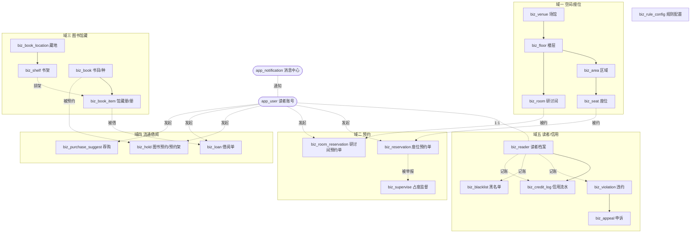

# 数据库设计说明书 · 高校图书馆预约系统

> SOP 主线 **02 数据库设计** 阶段产出。据 [01 需求规格说明书](01-需求规格说明书.md) 的功能清单/角色权限矩阵/闭环自检表设计表结构，与 `sql/schema.sql` **逐字一致**，已在本机 MySQL（`library_reservation`）真实建库跑通。

## 0 设计约定与复用

- **字符集**：全库 `utf8mb4` / `utf8mb4_general_ci`（与 RuoYi 核心库一致）。
- **主键**：`bigint`（Java `Long`），雪花算法（`@TableId` 默认 `ASSIGN_ID`），**不自增**。
- **多租户 + 审计**：业务表 `extends TenantEntity`，统一含 `tenant_id`（默认 `000000`）+ 审计五件套 `create_dept / create_by / create_time / update_by / update_time`，由基座自动填充；`create_dept / create_by` 是数据权限（按部门/本人过滤）依据。
- **逻辑删除**：需软删的表带 `del_flag`（`char(1)`，`@TableLogic`，`0` 存在 `1` 删除）。**流水表 `biz_credit_log` 为 append-only，不建 `del_flag`、查询不加该条件**（避免 `Unknown column` 500）。
- **类型映射**：`bigint→Long`、`tinyint→Integer`（状态/类型枚举）、`decimal(10,2)→BigDecimal`（仅 `biz_book.price` 登记用，本项目无交易）、`char(1)/varchar→String`、`datetime→Date`、`date→Date`。
- **外键**：**逻辑外键**（外键列 + 索引，不加物理约束），规避 `errno 150`。
- **枚举**：状态/类型用 `tinyint` 小整数存库，值域在字段 COMMENT 全列；前端展示走 `sys_dict` 字典翻译。
- **复用基座（不重复造）**：
    - **读者账号 = `app_user`**（C 端，`ruoyi-app`）；实名+信用扩展见子表 `biz_reader`（1:1）。
    - **消息中心 = `app_notification`**（`ruoyi-message`）：到书/催还/到期/被监督/审批结果/违约/公告均写此表，`biz_type`+`biz_id` 挂载业务，`receiver_id`→`app_user`。
    - **RBAC/管理员 = `sys_user`/`sys_role`/`sys_menu`/`sys_dept`/`sys_role_menu`/`sys_dict_*`**（流通/采编/系统三管理员为 `sys_user`）。
- **业务表前缀 `biz_`**，共 **21 张**，分六域。
- **`reader_id` 约定**：所有业务表的 `reader_id` = `app_user.id`（C 端账号主键），**不是** `biz_reader.id`。取读者档案/信用一律 `JOIN biz_reader ON biz_reader.user_id = reader_id`。
- **唯一键与软删**：`uk_seat_area_no` / `uk_item_barcode` / `uk_reader_student_no` / `uk_rule_key` 未含 `del_flag`——这些标识/配置项按**硬删或不复用旧编号**处理（规避 RuoYi 逻辑删除后同键再插撞唯一约束的经典坑）。
- **定时任务参数**：各 `@Scheduled` 任务的开关/cron 存 `biz_rule_config`（`rule_group='task'`），系统管理员可配（不启用 SnailJob `sj_*`）。
- **公告 / 操作审计**：公告复用 `app_notification`（`biz_type='notice'`）下发；敏感操作审计复用基座 `sys_oper_log`——均不另建 `biz` 表。

## 1 实体关系总览



## 2 表清单

### 域一 · 空间/座位（亮点① 选座+寻书 的平面图底座）

| 表名 | 说明 | 关键字段 |
|---|---|---|
| `biz_venue` | 场馆 | id, venue_name, open_time, close_time, status |
| `biz_floor` | 楼层 | id, venue_id, floor_name, **floor_plan_url**, status |
| `biz_area` | 区域 | id, floor_id, area_name, area_type, status |
| `biz_seat` | 座位 | id, area_id, seat_no, seat_type, **pos_x/pos_y**, qr_code, status |
| `biz_room` | 研讨间（空间预约） | id, floor_id, capacity, min_users, need_approve, pos_x/pos_y |

### 域二 · 座位/研讨间预约

| 表名 | 说明 | 关键字段 |
|---|---|---|
| `biz_reservation` | 座位预约单 | id, reader_id, seat_id, reserve_date, start/end_time, **status(0-5)**, check_in_time, away_start_time |
| `biz_room_reservation` | 研讨间预约单 | id, reader_id, room_id, **status(0-6)**, approve_by, reject_reason |
| `biz_supervise` | 占座监督记录 | id, reservation_id, reporter_id, deadline, **status(0-2)** |

### 域三 · 图书馆藏/采编

| 表名 | 说明 | 关键字段 |
|---|---|---|
| `biz_book_location` | 藏地（借阅室） | id, location_name, floor_id, status |
| `biz_shelf` | 书架（排架/寻书定位） | id, location_id, shelf_no, call_no_start/end, **pos_x/pos_y** |
| `biz_book` | 书目（种/Bib） | id, isbn, title, author, clc_no, call_no, total_qty, avail_qty, status(0-2) |
| `biz_book_item` | 馆藏册（册/Item） | id, book_id, **barcode(uk)**, shelf_id, **status(0-6)**, withdraw_type |

### 域四 · 流通借阅

| 表名 | 说明 | 关键字段 |
|---|---|---|
| `biz_loan` | 借阅单 | id, reader_id, item_id, borrow_time, due_time, renew_count, **status(0-2)**, recall_flag |
| `biz_hold` | 图书预约(hold)/预约架 | id, reader_id, book_id, item_id, queue_no, **status(0-4)**, hold_deadline |
| `biz_purchase_suggest` | 读者荐购 | id, reader_id, title, isbn, **status(0-3)**, handle_by |

### 域五 · 读者/信用/黑名单（亮点② 信用分体系）

| 表名 | 说明 | 关键字段 |
|---|---|---|
| `biz_reader` | 读者档案（app_user 扩展 1:1） | id, user_id(uk), **student_no(uk)**, credit_score, blacklist_flag, blacklist_end_time |
| `biz_credit_log` | 信用流水（append-only，无 del_flag） | id, reader_id, delta, reason_type, **score_after**, biz_type/biz_id |
| `biz_violation` | 违约记录 | id, reader_id, violation_type, deduct_score, **status(0-1)** |
| `biz_appeal` | 违约申诉 | id, violation_id, reader_id, reason, **status(0-2)**, audit_by |
| `biz_blacklist` | 黑名单 | id, reader_id, start_time, end_time, **status(0-1)**, release_type |

### 域六 · 规则配置

| 表名 | 说明 | 关键字段 |
|---|---|---|
| `biz_rule_config` | 规则配置（座位时段/借期/信用规则） | id, rule_group, rule_key(uk), rule_value |

> **共享审计字段**（下文各表字段明细不再逐行重复）：`create_dept` `create_by` `create_time` `update_by` `update_time`（继承 `TenantEntity`，基座 `MetaObjectHandler` 在 insert/update 时自动填充）+ `tenant_id`（默认 `000000`）+ `del_flag`（`char(1)` 0存在/1删除）。**例外 `biz_credit_log`**：append-only 流水，保留 `create_*`/`update_*` 两套审计列（继承基类填充需要，`update_*` 恒 NULL）但**无 `del_flag`**（不软删，查询不加该条件）。

## 3 字段明细（每表业务字段；审计字段见上方共享说明）

### 3.1 `biz_venue` 场馆
| 字段 | 类型 | 约束/索引 | 说明 |
|---|---|---|---|
| id | bigint | PK | 场馆ID |
| venue_name | varchar(100) | NOT NULL | 场馆名称 |
| address | varchar(255) | | 地址 |
| open_time / close_time | varchar(20) | | 开馆/闭馆时间（HH:mm） |
| sort | int | | 排序 |
| status | tinyint | | 0正常 1停用 |

### 3.2 `biz_floor` 楼层
| 字段 | 类型 | 约束/索引 | 说明 |
|---|---|---|---|
| id | bigint | PK | 楼层ID |
| venue_id | bigint | idx | 所属场馆（biz_venue） |
| floor_name | varchar(50) | NOT NULL | 楼层名称 |
| floor_no | int | | 楼层号 |
| floor_plan_url | varchar(500) | | 楼层平面图底图URL（选座+寻书共用，MinIO） |
| sort / status | int / tinyint | | 排序 / 0正常 1停用 |

### 3.3 `biz_area` 区域
| 字段 | 类型 | 约束/索引 | 说明 |
|---|---|---|---|
| id | bigint | PK | 区域ID |
| floor_id | bigint | idx | 所属楼层 |
| area_name | varchar(50) | NOT NULL | 区域名称 |
| area_type | tinyint | | 0自习阅览 1研讨区 2其它 |
| sort / status | int / tinyint | | 排序 / 0正常 1停用 |

### 3.4 `biz_seat` 座位
| 字段 | 类型 | 约束/索引 | 说明 |
|---|---|---|---|
| id | bigint | PK | 座位ID |
| area_id | bigint | idx | 所属区域 |
| seat_no | varchar(30) | uk(area_id,seat_no,tenant_id) | 座位编号（区域内唯一） |
| seat_type | tinyint | | 0普通 1靠窗 2沙发 3单间 |
| has_power | tinyint | | 0无 1有 |
| pos_x / pos_y | int | | 平面图坐标（亮点①选座） |
| qr_code | varchar(64) | | 桌面二维码标识（扫码签到） |
| status | tinyint | | 0正常 1停用（实时占用由预约单推导，不落座位表） |

### 3.5 `biz_room` 研讨间
| 字段 | 类型 | 约束/索引 | 说明 |
|---|---|---|---|
| id | bigint | PK | 研讨间ID |
| floor_id | bigint | idx | 所属楼层 |
| room_name | varchar(50) | NOT NULL | 名称/编号 |
| capacity | int | | 容纳人数 |
| min_users | int | | 预约最少人数 |
| need_approve | tinyint | | 0否 1是（是否需审批） |
| need_checkin | tinyint | | 0否 1是（是否需签到） |
| pos_x / pos_y | int | | 平面图坐标 |
| status | tinyint | | 0正常 1停用 |

### 3.6 `biz_reservation` 座位预约单
| 字段 | 类型 | 约束/索引 | 说明 |
|---|---|---|---|
| id | bigint | PK | 座位预约单ID |
| reader_id | bigint | idx(reader_id,status) | 读者（app_user） |
| seat_id | bigint | idx(seat_id,reserve_date) | 座位 |
| venue_id / floor_id / area_id | bigint | | 冗余（统计用） |
| reserve_date | date | NOT NULL | 预约日期 |
| start_time / end_time | datetime | NOT NULL | 时段起止 |
| source | tinyint | | 1平面图选座 2快速选座 3现场扫码 |
| **status** | tinyint | idx(status,end_time) | **0待签到 1使用中 2暂离中 3已完成 4已取消 5已违约** |
| check_in_time | datetime | | 签到时间 |
| away_start_time / away_count | datetime / int | | 本次暂离开始 / 暂离次数 |
| actual_end_time / cancel_time | datetime | | 实际结束 / 取消时间 |
| remark | varchar(255) | | 备注（强制释放原因等） |

> 座位资源不变式：同座同时段至多一条有效占用（status ∈ {0,1,2}），释放（4/5 或到期）后即可再约——业务层校验兜底 + `idx_rsv_seat_date`。

### 3.7 `biz_room_reservation` 研讨间预约单
| 字段 | 类型 | 约束/索引 | 说明 |
|---|---|---|---|
| id | bigint | PK | 研讨间预约单ID |
| reader_id | bigint | idx(reader_id,status) | 预约读者 |
| room_id | bigint | idx(room_id,reserve_date) | 研讨间 |
| reserve_date / start_time / end_time | date/datetime | NOT NULL | 日期与时段 |
| user_count | int | | 使用人数 |
| **status** | tinyint | | **0待审批 1已通过待使用 2使用中 3已完成 4已取消 5已驳回 6已违约** |
| check_in_time | datetime | | 签到时间 |
| approve_by / approve_time | bigint / datetime | | 审批人（sys_user）/ 时间 |
| reject_reason | varchar(255) | | 驳回原因 |

### 3.8 `biz_supervise` 占座监督记录
| 字段 | 类型 | 约束/索引 | 说明 |
|---|---|---|---|
| id | bigint | PK | 监督记录ID |
| reservation_id | bigint | idx | 被监督的座位预约单 |
| seat_id | bigint | | 座位 |
| reporter_id | bigint | | 举报读者（app_user） |
| report_time | datetime | NOT NULL | 举报时间 |
| deadline | datetime | idx(status,deadline) | 原用户落座截止 |
| **status** | tinyint | | **0进行中 1已解除(落座) 2超时释放** |
| resolve_time | datetime | | 解除/释放时间 |

### 3.9 `biz_book_location` 藏地
| 字段 | 类型 | 约束/索引 | 说明 |
|---|---|---|---|
| id | bigint | PK | 藏地ID |
| location_name | varchar(100) | NOT NULL | 藏地名称（借阅室） |
| floor_id | bigint | idx | 所在楼层（寻书平面图定位） |
| sort / status | int / tinyint | | 排序 / 0正常 1停用 |

### 3.10 `biz_shelf` 书架
| 字段 | 类型 | 约束/索引 | 说明 |
|---|---|---|---|
| id | bigint | PK | 书架ID |
| location_id | bigint | idx | 所属藏地 |
| shelf_no | varchar(30) | NOT NULL | 架号 |
| call_no_start / call_no_end | varchar(50) | | 索书号排架区间 |
| pos_x / pos_y | int | | 平面图坐标（亮点①寻书） |
| status | tinyint | | 0正常 1停用 |

### 3.11 `biz_book` 书目（种/Bib）
| 字段 | 类型 | 约束/索引 | 说明 |
|---|---|---|---|
| id | bigint | PK | 书目ID |
| isbn | varchar(20) | idx | ISBN |
| title | varchar(255) | NOT NULL, idx | 题名 |
| author | varchar(255) | | 著者 |
| publisher / publish_date | varchar | | 出版社 / 出版日期 |
| clc_no | varchar(50) | idx | 中图法分类号 |
| call_no | varchar(50) | | 索书号（种级基准） |
| cover_url | varchar(500) | | 封面图URL（MinIO） |
| summary | varchar(2000) | | 内容简介 |
| price | decimal(10,2) | | 定价（登记用，非交易） |
| total_qty / avail_qty | int | | 复本总数 / 当前可借数（冗余，借还维护） |
| **status** | tinyint | | **0在编 1已上架(可借) 2已下架** |

> 主题词检索走 `title` / `author` / `summary` 模糊匹配（不单列 `subject` 字段）；座位/研讨间用自由 `datetime` 时段，固定时段模板（如需）以 JSON 存 `biz_rule_config`（`rule_group='seat'`）。

### 3.12 `biz_book_item` 馆藏册（册/Item）
| 字段 | 类型 | 约束/索引 | 说明 |
|---|---|---|---|
| id | bigint | PK | 馆藏册ID |
| book_id | bigint | idx | 所属书目 |
| barcode | varchar(40) | uk(barcode,tenant_id) | 条码（每册唯一） |
| call_no | varchar(60) | | 索书号（含别本/种次号） |
| location_id | bigint | | 藏地 |
| shelf_id | bigint | idx | 书架/排架位（寻书定位） |
| **status** | tinyint | idx | **0在编 1可借在架 2借出 3在预约架 4遗失 5损坏 6已注销** |
| withdraw_type | tinyint | | 注销类型：1剔旧 2报损 3遗失核销（status=6 时填） |
| withdraw_reason / withdraw_time | varchar / datetime | | 注销原因 / 时间 |

### 3.13 `biz_loan` 借阅单
| 字段 | 类型 | 约束/索引 | 说明 |
|---|---|---|---|
| id | bigint | PK | 借阅单ID |
| reader_id | bigint | idx(reader_id,status) | 读者（app_user） |
| item_id | bigint | idx | 馆藏册 |
| book_id | bigint | | 书目（冗余） |
| borrow_time / due_time | datetime | NOT NULL；idx(status,due_time) | 借出时间 / 应还日 |
| renew_count | int | | 已续借次数 |
| return_time | datetime | | 归还时间 |
| **status** | tinyint | | **0在借 1已还 2逾期(在借且超期)** |
| overdue_flag | tinyint | | 是否曾逾期 0否 1是 |
| recall_flag / recall_time | tinyint / datetime | | 是否被预约催还 / 催还时间 |
| borrow_location / return_location | bigint | | 借出/归还藏地（通借通还预留） |
| operator_id | bigint | | 经办流通员（sys_user） |

### 3.14 `biz_hold` 图书预约(hold)/预约架
| 字段 | 类型 | 约束/索引 | 说明 |
|---|---|---|---|
| id | bigint | PK | 图书预约ID |
| reader_id | bigint | idx(reader_id,status) | 读者 |
| book_id | bigint | idx(book_id,status) | 书目 |
| item_id | bigint | | 到书保留的馆藏册（到书后指定） |
| queue_no | int | | 队列位次 |
| **status** | tinyint | | **0排队中 1到书保留(在预约架) 2已取书 3已取消 4过期释放** |
| hold_time / ready_time | datetime | | 预约时间 / 到书时间 |
| hold_deadline | datetime | idx(status,hold_deadline) | 预约架保留期截止 |
| pickup_time / cancel_time | datetime | | 取书 / 取消时间 |

### 3.15 `biz_purchase_suggest` 读者荐购
| 字段 | 类型 | 约束/索引 | 说明 |
|---|---|---|---|
| id | bigint | PK | 荐购ID |
| reader_id | bigint | idx(reader_id,status) | 荐购读者 |
| title | varchar(255) | NOT NULL | 书名 |
| author / isbn | varchar | | 著者 / ISBN |
| reason | varchar(500) | | 荐购理由 |
| **status** | tinyint | | **0待受理 1已受理(转采购) 2已驳回 3已采购** |
| handle_by / handle_time | bigint / datetime | | 处理人（采编 sys_user）/ 时间 |
| reject_reason | varchar(255) | | 驳回原因 |

### 3.16 `biz_reader` 读者档案（app_user 扩展 1:1）
| 字段 | 类型 | 约束/索引 | 说明 |
|---|---|---|---|
| id | bigint | PK | 读者档案ID |
| user_id | bigint | uk(user_id,tenant_id) | 关联 app_user（1:1） |
| student_no | varchar(30) | uk(student_no,tenant_id) | 学号/校园卡号（实名唯一） |
| real_name / college / major | varchar | | 姓名 / 院系 / 专业 |
| credit_score | int | | 当前信用分 0-100（冗余；权威=Σ credit_log.delta） |
| perform_count | int | | 守信(履约)次数 |
| blacklist_flag | tinyint | idx(blacklist_flag,blacklist_end_time) | 是否黑名单 0否 1是 |
| blacklist_end_time | datetime | | 黑名单暂停到期 |
| status | tinyint | | 0正常 1受限 2停用 |

### 3.17 `biz_credit_log` 信用流水（append-only，无 del_flag）
| 字段 | 类型 | 约束/索引 | 说明 |
|---|---|---|---|
| id | bigint | PK | 信用流水ID |
| reader_id | bigint | idx(reader_id,create_time) | 读者（app_user） |
| delta | int | NOT NULL | 本次变动分值（带符号 +/-） |
| reason_type | tinyint | NOT NULL | 1建档 2座位爽约 3暂离超时 4监督未落座 5未签退 6图书逾期 7预约架超期 8遗失损坏 9履约加分 10时间衰减 11申诉冲正 12黑名单校准 |
| reason_desc | varchar(255) | | 事由说明 |
| biz_type / biz_id | varchar(50) / bigint | | 关联业务类型 / ID |
| score_after | int | NOT NULL | 变动后信用分（=截至本条 Σdelta 并 clamp 0-100，供查库对平） |

> 含 `create_*` 与 `update_*`（继承 `BaseEntity`，insert 时基座会填充 `update_*`，故必须保留两列以免 `Unknown column` 报错；append-only 恒不更新，`update_*` 保持 NULL）；**无 `del_flag`**（append-only 不软删，查询不加该条件）。

### 3.18 `biz_violation` 违约记录
| 字段 | 类型 | 约束/索引 | 说明 |
|---|---|---|---|
| id | bigint | PK | 违约记录ID |
| reader_id | bigint | idx(reader_id,status) | 读者 |
| violation_type | tinyint | idx | 1座位爽约 2暂离超时 3监督未落座 4未签退 5图书逾期 6预约架超期 7遗失损坏 |
| biz_type / biz_id | varchar / bigint | | 关联业务 |
| deduct_score | int | | 扣分 |
| occur_time | datetime | NOT NULL | 发生时间 |
| source | tinyint | | 0系统判定 1管理员登记 |
| **status** | tinyint | | **0有效 1已申诉解除** |

### 3.19 `biz_appeal` 违约申诉
| 字段 | 类型 | 约束/索引 | 说明 |
|---|---|---|---|
| id | bigint | PK | 申诉ID |
| violation_id | bigint | idx | 被申诉的违约记录 |
| reader_id | bigint | idx(reader_id,status) | 申诉读者 |
| reason | varchar(500) | NOT NULL | 申诉理由 |
| **status** | tinyint | | **0待审 1通过(解除违约+冲正) 2驳回** |
| audit_by / audit_time | bigint / datetime | | 审批人（流通 sys_user）/ 时间 |
| audit_remark | varchar(255) | | 审批意见 |

### 3.20 `biz_blacklist` 黑名单
| 字段 | 类型 | 约束/索引 | 说明 |
|---|---|---|---|
| id | bigint | PK | 黑名单ID |
| reader_id | bigint | idx(reader_id,status) | 读者 |
| reason | varchar(255) | | 拉黑原因 |
| start_time | datetime | NOT NULL | 生效时间 |
| end_time | datetime | idx(status,end_time) | 暂停到期 |
| **status** | tinyint | | **0生效中 1已解除** |
| release_type | tinyint | | 解除方式：1到期自动 2申诉通过 3手动 |
| release_time | datetime | | 解除时间 |

### 3.21 `biz_rule_config` 规则配置（已接线·真正生效）
| 字段 | 类型 | 约束/索引 | 说明 |
|---|---|---|---|
| id | bigint | PK | 规则配置ID |
| rule_group | varchar(50) | uk(rule_group,rule_key,tenant_id) | 分组：seat座位/credit信用·违约·封禁（book/task 预留） |
| rule_key | varchar(80) | uk | 规则键（见下方默认种子清单） |
| rule_value | varchar(100) | NOT NULL | 规则值（统一 varchar，业务侧按需 parseInt / 解析 HH:mm） |
| remark | varchar(255) | | 说明 |

> **接线机制**：`RuleConfigHelper`（`@Component`，内存缓存 + 写时失效）统一读取；6 个业务 Service（Reservation / LibraryAuto / Supervise / Violation / Credit / Blacklist）去掉硬编码常量改读配置。**表为空 / 键缺失时回落内置默认值**（= 原硬编码值），保证未灌种子也能跑。前端「规则配置」CRUD 改值后**免重启即时生效**（已 Playwright 实证：pause_score 改 101 → 约座被拒"信用分过低（<101）"）。默认种子见 `sql/seed_rule_config.sql`。

**默认种子清单**（取值对齐真实高校调研 `docs/specs/2026-08-03-cn-library-rules-research.md`）：

| 分组 | rule_key | 默认值 | 说明 |
|---|---|---|---|
| seat | checkin_window_min | 30 | 签到弹性窗（分钟，前后各 N 分钟内需签到） |
| seat | away_keep_min | 30 | 暂离保留时长（普通时段，分钟） |
| seat | overdue_grace_min | 10 | 到期签退宽限（普通时段，分钟） |
| seat | supervise_deadline_min | 20 | 占座监督响应时长（分钟，对齐超星） |
| seat | daily_cancel_limit | 2 | 每读者每日取消预约次数上限（0=不限） |
| seat | lunch_start / lunch_end / lunch_keep_min | 11:00 / 12:30 / 150 | 午餐时段窗口 + 特殊保留时长 |
| seat | dinner_start / dinner_end / dinner_keep_min | 17:00 / 18:30 / 90 | 晚餐时段窗口 + 特殊保留时长 |
| credit | init_score / score_min / score_max | 100 / 0 / 100 | 初始分 / clamp 下界 / clamp 上界 |
| credit | pause_score | 20 | 信用分低于此值暂停预约（信用线阈值） |
| credit | recover_score | 60 | 解除黑名单后校准到的门槛分 |
| credit | decay_days / decay_score | 30 / 5 | 无违约衰减恢复周期（天）/ 每周期回补分 |
| credit | perform_bonus | 1 | 按时退座履约加分 |
| credit | deduct_type1..7 | 10/5/10/5/5/5/20 | 各违约类型扣分（爽约/暂离/监督/未签退/图书逾期/预约架超期/遗失损坏） |
| credit | ban_window_days / ban_violation_count / ban_days | 7 / 3 / 7 | 违约线：近 N 天滑窗累计达阈值 → 封禁 N 天 |

> **信用线 ↔ 违约线（两条独立、互不覆盖、各自可配）**：① 信用线——信用分 `< pause_score` 暂停预约；② 违约线——近 `ban_window_days` 天内有效违约（`biz_violation.status=0` 且 `occur_time > now − N 天`）累计达 `ban_violation_count` → 封禁 `ban_days` 天。真实高校"累计计次不设窗口（如清华/超星累计 5 次）"亦常见，改 `ban_window_days` 放大即可近似。就餐时段（午/晚窗口内）暂离/未签退按 `lunch_keep_min`/`dinner_keep_min` 特殊保留。

## 4 闭环 / 对平字段自检表

> 对照 [闭环铁律](01-需求规格说明书.md) 与 [SRS §5 业务闭环自检表](01-需求规格说明书.md#sec-loop)：每个正向操作在表上都有反向出口对应的状态值/字段。本项目无资金，"对平"用**信用一致性不变式**替代。

### 4.1 状态机闭环（正向 ↔ 反向出口有落点）

| 业务 | 正向（状态值） | 反向/收尾出口（状态值/字段） | 承载表.字段 | 齐 |
|---|---|---|---|---|
| 座位预约 | status=0 待签到 | 取消=4 / 爽约释放=5 | biz_reservation.status | ✓ |
| 签到使用 | status=1 使用中 | 退座完成=3 / 到期释放=3(actual_end_time) | biz_reservation.status | ✓ |
| 暂离 | status=2 暂离中(away_start_time) | 返回=1 / 暂离超时=5 | biz_reservation.status, away_start_time | ✓ |
| 续座 | 延长 end_time（校验后续时段空闲） | 不续→到期释放=3 | biz_reservation.end_time | ✓ |
| 研讨间预约 | status=0/1 待审批/待使用 | 取消=4 / 驳回=5 / 到期违约=6 | biz_room_reservation.status | ✓ |
| 占座监督 | status=0 进行中(deadline) | 落座解除=1 / 超时释放=2 | biz_supervise.status | ✓ |
| 馆藏册流转 | status=1 可借 → 2 借出 | 归还→1 / 遗失损坏 4/5 → 核销 6 | biz_book_item.status, withdraw_* | ✓ |
| 上架/注销 | book.status=1 上架 | 下架=2 / item 注销=6 | biz_book.status, biz_book_item.status | ✓ |
| 借阅 | loan.status=0 在借 | 归还=1 / 逾期=2→归还解除 | biz_loan.status, return_time | ✓ |
| 续借 | renew_count+1（延 due_time） | 逾期/被预约(recall_flag)不可续 | biz_loan.renew_count, recall_flag | ✓ |
| 图书预约hold | status=0 排队 → 1 到书保留 | 取消=3 / 超期释放=4 / 取书=2 | biz_hold.status, hold_deadline | ✓ |
| 荐购 | status=0 待受理 | 受理=1 / 驳回=2 / 采购=3 | biz_purchase_suggest.status | ✓ |
| 违约 | violation.status=0 有效 | 申诉解除=1 | biz_violation.status, biz_appeal | ✓ |
| 申诉 | appeal.status=0 待审 | 通过=1 / 驳回=2 | biz_appeal.status | ✓ |
| 黑名单 | status=0 生效中(end_time) | 到期/申诉/手动解除=1 | biz_blacklist.status, release_type | ✓ |

### 4.2 信用一致性不变式（对平，可查库校验）

- **两个量**：`raw_sum = Σ biz_credit_log.delta`（**原始账本和，不设边界**，可能瞬时 <0 或 >100）；`credit_score`（**显示值**）= `clamp(raw_sum, 0, 100)`。
- **不变式**：任一读者 `biz_reader.credit_score` == `clamp(Σ delta, 0, 100)`；每条 `score_after` == `clamp(截至本条的 Σ delta, 0, 100)`（`score_after` 是显示值快照，等价资金流水的 `balance_after`）。
- **关键口径**（避免 raw_sum 跌破 0 后校准/冲正算偏——本项目定死）：
    - **扣分足额**：违约扣分写 `delta = −deduct_score`，**不因当前显示分不足而截断**，全额落到 raw_sum；故 `biz_violation.deduct_score` 恒等于 `|delta|`。
    - **申诉冲正**（`reason_type=11`）：`delta = +原违约 deduct_score`，精确反向，raw_sum 复原（不与"从有效违约剔除"重复计算）。
    - **黑名单解除/重置**（赋值型，`reason_type=12`）：`delta = 目标分 − 当前 raw_sum`（**基准是未 clamp 的 raw_sum，不是显示分**），使 raw_sum 精确落到目标分（如门槛 60）。
    - `clamp` 只作用于显示值 / `score_after`，**从不改变已入账的 delta**——保证冲正/校准恒可逆、查库恒平。
- **append-only**：`biz_credit_log` 不软删（无 `del_flag`），任何变动只追加不修改。
- **可查库校验 SQL（示意）**：
  ```sql
  -- 找出冗余分与流水汇总不一致的读者（应为空）
  SELECT r.user_id, r.credit_score,
         LEAST(GREATEST(IFNULL(SUM(c.delta),0),0),100) AS calc
  FROM biz_reader r
  LEFT JOIN biz_credit_log c ON c.reader_id = r.user_id
  GROUP BY r.user_id, r.credit_score
  HAVING r.credit_score <> calc;
  ```

### 4.3 消息闭环（复用 app_notification）

到书/催还/到期/被监督/研讨间审批结果/违约/申诉结果/公告 → 写 `app_notification`（`biz_type` 区分、`biz_id` 关联、`receiver_id`→读者），读者端"消息通知"读取。无孤儿：SRS §3.1 各反向出口均有对应通知类型。

### 4.4 冗余字段一致性口径（双事实源不漂移）

除信用分外，另有 2 处冗余需在借还/注销/拉黑时**即时维护**，并可查库自检：

| 冗余字段 | 权威来源（明细） | 维护时机 | 校验 SQL（应为空/一致） |
|---|---|---|---|
| `biz_book.avail_qty` | `COUNT(biz_book_item WHERE book_id=? AND status=1 可借)` | 借出/归还/上下架/注销 | `SELECT b.id FROM biz_book b LEFT JOIN biz_book_item i ON i.book_id=b.id AND i.status=1 AND i.del_flag='0' GROUP BY b.id HAVING b.avail_qty<>COUNT(i.id);` |
| `biz_book.total_qty` | `COUNT(biz_book_item WHERE book_id=? AND status<>6 未注销)` | 新增复本/注销 | 同上，比 `status<>6` 计数 |
| `biz_reader.blacklist_flag` | `EXISTS(biz_blacklist WHERE reader_id=? AND status=0 生效中)` | 拉黑/解除时同步 | `SELECT r.user_id FROM biz_reader r WHERE r.blacklist_flag<>EXISTS(SELECT 1 FROM biz_blacklist bl WHERE bl.reader_id=r.user_id AND bl.status=0);` |

## 5 建库与验证

- **导入顺序**：先导 RuoYi 核心 `script/sql/ry_vue_5.X.sql`（`sys_*`，00 阶段已导）+ 基座 `app_user.sql` / `app_notification.sql`，**再导** `sql/schema.sql`。
- **本机已跑通**：`mysql -uroot -p123456 --default-character-set=utf8mb4 library_reservation < sql/schema.sql` 无语法/外键错，21 张 `biz_` 表 + 复用表建成，中文 COMMENT 正常。

## 源

- 本页与 `sql/schema.sql` 逐字一致（表/字段/枚举）；据 [01 需求规格说明书](01-需求规格说明书.md)（功能清单/权限矩阵/闭环自检表）设计。
- 规范依据：SOP 主线《02 数据库设计》（类型映射/逻辑删除/审计字段/命名/闭环字段自检）、《闭环铁律》；复用基座 `app_user`（ruoyi-app）、`app_notification`（ruoyi-message）。
- 环境：本机 MySQL `library_reservation`（root/123456），utf8mb4。
