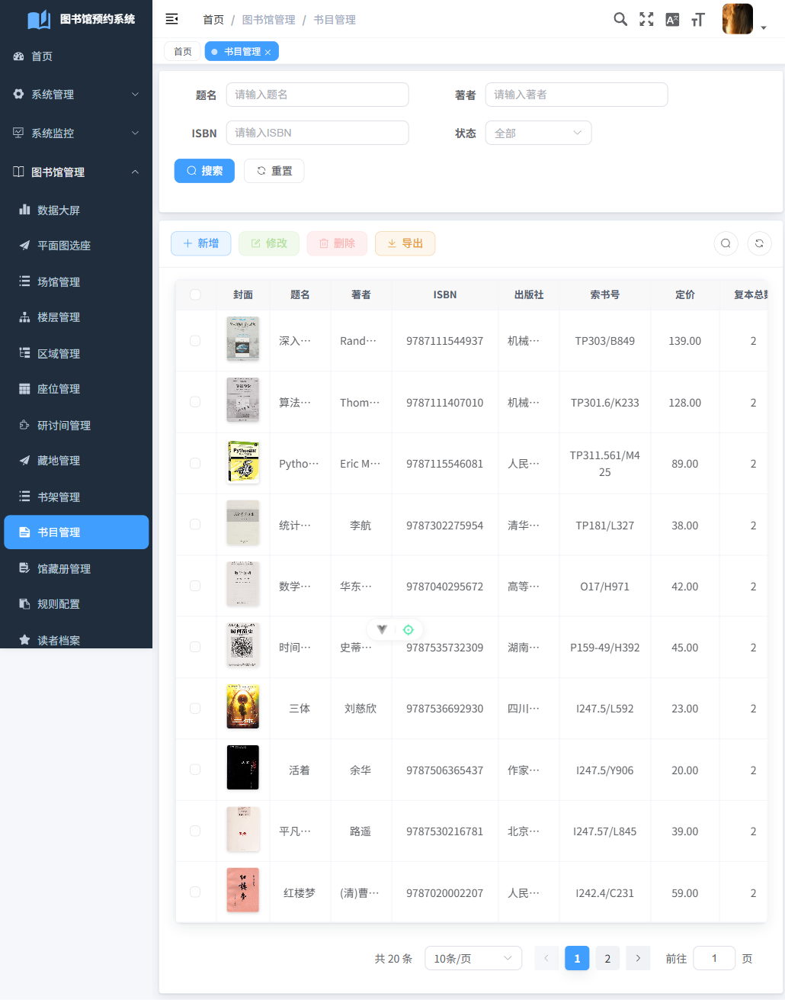
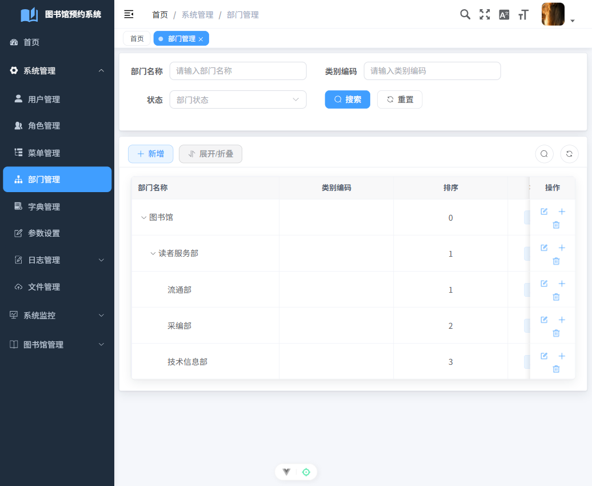
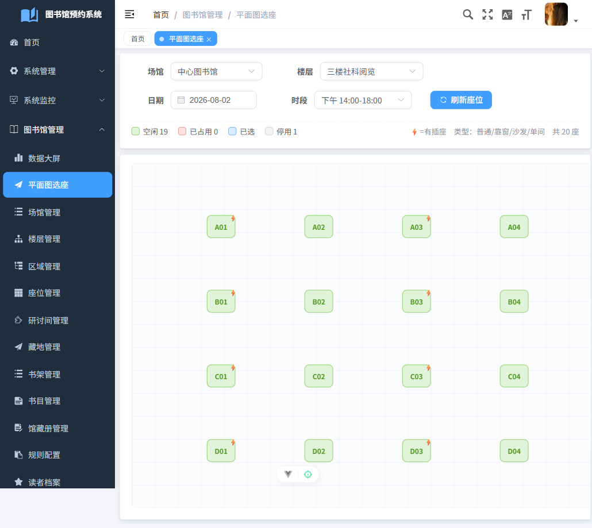
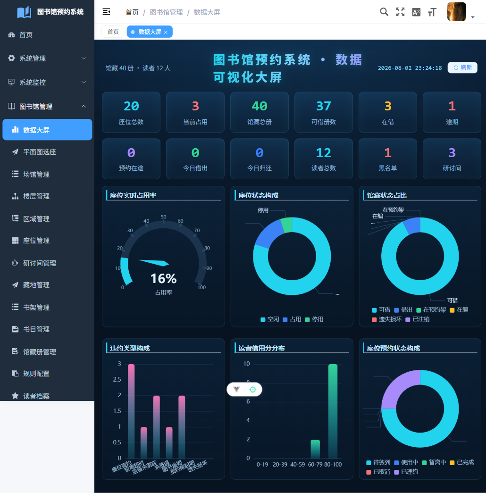

# 03 · 交付说明

> 本页汇总系统构成、演示数据、去 RuoYi 化验收截图、功能亮点与启动/部署说明，作为交付与答辩的对照依据。

## 一、系统概览

- **构成**：Web 管理后台（RuoYi-Vue-Plus / plus-ui）＋ 微信小程序读者端（uni-app，移动端复用同一后端）。
- **技术栈**：Spring Boot · MyBatis-Plus · Sa-Token · MySQL · Redis · MinIO · SnailJob；前端 Vue3 + TypeScript + Element Plus + ECharts。
- **三大亮点**：
    1. **可视化平面图选座 / 寻书**——「区域 → 桌子 → 座位」三级空间模型，平面图**一桌展开多座成组、点空座预约**；图书按索书号排架，读者可视化寻书。
    2. **信用分体系 + 定时任务**——爽约/逾期/超时自动扣分并联动黑名单；SnailJob 定时扫描自动释放、判定违约、恢复信用。
    3. **数据可视化大屏**——座位占用、馆藏流通、违约构成、信用分布多维实时聚合。

## 二、演示数据说明（图文一一对应） {#sec-data}

全量成套演示数据，图书封面均为**真实书目封面**（经 OpenLibrary 下载入 MinIO，逐本核对图文相符）：

| 数据项 | 数量 | 说明 |
|---|---:|---|
| 书目 | 20 | 计算机/数理/文学/历史/哲学/经济/语言 多分类，**封面图文一一对应** |
| 馆藏册 | 40 | 每书 2 复本，按中图法索书号上架到对应书架 |
| 读者 | 12 | 信用分梯度分布（100/90/85/75…）便于大屏演示 |
| 桌子（工位组） | 10 | A区自习 10 张四人桌（2 排×5），三级空间模型中间层，带绝对坐标/宽高/桌形 |
| 座位 | 40 | 挂到桌子（每桌 4 座）+ 相对桌子偏移，平面图一桌展开多座 |
| 楼层/区域/藏地/书架 | 3 / 4 / 3 / 6 | 场馆→楼层→区域→桌子→座位、藏地→书架→馆藏册两条主数据链 |
| 研讨间 | 3 | 含需审批/免审批 |
| 在途单 | 座位预约 4 · 借阅 3(含逾期1) · 研讨间预约 3 · 荐购 4 · 占座监督 3 | 各状态齐全，闭环可演示 |
| 违约记录 | 8 | 座位爽约/暂离超时/监督未落座/未签退/图书逾期 多类型 |
| 规则配置 | 29 | `biz_rule_config` 默认参数（seat 11 + credit 18）：签到窗/暂离/就餐保留/每日取消/封禁/信用扣分等可配 |

> 一致性自检：0 孤儿记录、外键全部有效、`avail_qty` 与在借册对平、信用不变式（`credit_score = clamp(Σ credit_log.delta, 0, 100)`）0 例不符。

图书档案列表（封面缩略图，点击可放大，**图文对应**）：

{ width="760" }

## 三、去 RuoYi 化验收 {#sec-deruoyi}

按 SOP 六项门禁逐屏验收，全部为项目自有品牌、无 RuoYi 残留（全程 0 控制台错误）。

> 注：本节截图为**去 RuoYi 化验收当时**（默认蓝皮）留档；系统现已整体换 **Claude 暖阅读风**（珊瑚主色 + 奶油画布），最新视觉见 [§7.4 UI 换肤](#sec-enhance)。

### 登录页

无社交登录块、无租户选择器；标题与版权均为「图书馆预约系统 · 毕业设计作品」。

{ width="620" }

### 首页 · 顶栏 · 菜单 · Logo

首页为图书馆门户（欢迎横幅＋三亮点＋快捷入口）；左上 Logo 为书本图标＋「图书馆预约系统」；顶栏右上**无 GitHub / 无文档 / 无系统公告铃铛**；侧栏仅 系统管理 · 系统监控 · 图书馆管理（已隐藏 租户管理 / 工作流 / 我的任务 / 系统工具 / PLUS官网 / 测试菜单）。

{ width="760" }

### 部门树

RuoYi 演示公司（XXX科技/深圳总公司…）已换为图书馆组织：图书馆 → 读者服务部 → 流通部 / 采编部 / 技术信息部；admin 昵称改为「系统管理员」，自带 test/test1 演示账号已软删。

{ width="760" }

## 四、功能亮点截图 {#sec-highlights}

### 亮点① 可视化平面图选座

{ width="760" }

### 亮点③ 数据可视化大屏

{ width="760" }

> 亮点② 信用分体系 + SnailJob 定时任务：读者信用流水、违约自动判定与座位自动释放为后台/定时逻辑，运行证据见大屏「违约类型构成 / 读者信用分分布」与后端 `libraryAutoJob` 执行日志（每轮输出 爽约释放/暂离超时/到期未签退/图书逾期/预约架超期/信用衰减/黑名单解除/监督超时 计数）。

## 五、角色与账号 {#sec-roles}

| 账号 | 密码 | 角色 | 可见范围 |
|---|---|---|---|
| `admin` | `admin123` | 超级管理员 | 全部 |
| `liutong` | `admin123` | 流通管理员 | 平面图选座 / 座位预约 / 借阅 / 图书预约 / 违约 / 申诉 / 黑名单 / 研讨间预约 / 占座监督 ＋ 主数据只读 |
| `caibian` | `admin123` | 采编管理员 | 藏地 / 书架 / 书目 / 馆藏册 / 荐购受理 ＋ 读者只读 |
| `xitong` | `admin123` | 系统管理员 | 场馆 / 楼层 / 区域 / 座位 / 研讨间 / 藏地 / 书架 / 规则配置 / 读者档案 / 数据大屏 |

## 六、启动与部署 {#sec-deploy}

**依赖底座**：MySQL 本机原生（库 `library_reservation`，`root/123456@localhost:3306`）＋ Redis / MinIO / SnailJob 用 Docker（`docker compose up -d`）。

**后端**：双击 `scripts/run-backend.bat`（改后端代码后用 `run-backend.bat build` 重构建再起）；端口 **8199**。

**前端**：`plus-ui` 目录 `npm run dev`（改 `.env` 需重启 vite）；端口 **8188**。

**数据库脚本应用顺序**（幂等，顺序有依赖——`role_perm.sql` 会整段重建角色 10–12 授权，须先于 `menu_library_ext.sql` / `role_perm_ext.sql`）：

```text
1.  sql/schema.sql              # 22 张 biz_ 业务表（含 biz_desk 桌子层）
2.  sql/menu_library.sql        # 基础模块菜单
3.  sql/menu_desk.sql           # 桌子管理 菜单（id 12230 段，勿与数据大屏 12190 冲突）
4.  sql/snailjob_library.sql    # SnailJob 定时任务注册
5.  sql/role_perm.sql           # 3 角色 + 3 账号 + 基础授权
6.  sql/menu_library_ext.sql    # 研讨间预约/荐购/占座监督 菜单 + 授权
7.  sql/role_perm_ext.sql       # 流通/采编 主数据只读授权
8.  sql/deruoyi.sql             # 去 RuoYi 化(菜单可见/部门/账号)
9.  sql/seed_support.sql        # 楼层/区域/藏地/书架/研讨间/读者
10. sql/seed_seats_desks.sql    # A区自习 10 桌 × 4 座 = 40 座（需 area 1 先在）
11. sql/seed_ext_demo.sql       # 研讨间预约/荐购/占座监督 演示数据
12. sql/seed_rule_config.sql    # 规则配置默认参数（seat 11 + credit 18，无依赖、幂等）
13. python scripts/seed_demo_books.py   # 20 书目 + 真实封面(MinIO) + 借阅/违约/信用流水
```

> 改 `sys_menu` 后对应角色需**重新登录**刷新路由（超管也要重登）。

## 七、交付增强（对齐真实高校 + 体验 + 视觉） {#sec-enhance}

在主线交付基础上做的四项增强，均已本机验证、`mkdocs --strict` 过、逐项提交。

### 7.1 座位规则配置化

原先签到窗/暂离/宽限/封禁阈值/信用扣分等**散落硬编码**、`biz_rule_config` 表空且无人读。现新增 `RuleConfigHelper`（`@Component`，内存缓存 + 写时失效），6 个业务 Service 去硬编码改读配置——**后台「规则配置」改值免重启即时生效**（已实证：将 `pause_score` 改 101，约座即被拒「信用分过低（<101）」）。种子 `seed_rule_config.sql` 29 项，取值对齐真实高校调研（南开/华师大/清华/中传/超星）。

- 补齐三个真实馆规缺失维度：① **每日取消上限**（默认 2 次/天）；② **就餐时段特殊保留**（午 11:00–12:30 保留 150 分钟 / 晚 17:00–18:30 保留 90 分钟）；③ **违规封禁改近 7 天滑动窗口**（近 7 天有效违约达 3 次 → 封 7 天）。
- 理顺信用 ↔ 违约：**信用线**（信用分 < 阈值暂停）与**违约线**（滑窗计次封禁）两条独立、各自可配、互不覆盖。

### 7.2 座位空间模型补「桌子」层

座位空间从「区域→座位」两级升级为**「区域 → 桌子(工位组) → 座位」三级**：新增 `biz_desk`（容量/桌形/绝对坐标/宽高/旋转），`biz_seat` 加 `desk_id` + 相对偏移。A区自习重排为 **10 张四人桌（2 排×5）× 4 座 = 40 座**，平面图**一桌展开多座成组、点空座预约**。新增「桌子管理」全栈 CRUD 与菜单。**约座仍以座位为最小可预约单元，悲观行锁 + 时段重叠校验一字未动**；大屏座位计数口径不变。

### 7.3 体验优化（Phase 06）

- **事务页 ID 可读化**：座位预约/借阅/图书预约/违约/占座监督 列表把「读者ID/座位ID/图书ID」数字换成**姓名（学号）/ 书名 / 座位号 / 条码**（后端 VO 批量回填，无 N+1）。
- **数据大屏骨架屏** + 7 个核心列表**空态引导 CTA**（无数据给「去新增」引导，替代干巴巴空态）。
- **一致性**：全局柔和表头 + 操作列按钮自动换行（多操作不再挤贴/溢出）。
- **响应式**：320–390px 窄屏优雅降级（侧栏收汉堡、表单堆叠、无页面级二维滚动）。
- **无障碍**：axe-core 扫描严重项 14 → 10，`html-has-lang / meta-viewport / image-alt / button-name` 四类清零（剩余为 element-plus 组件内建）。
- 修复一处回归：桌子管理菜单 id 曾与「数据大屏」冲突致大屏 404，已改 id 并恢复。

### 7.4 UI 视觉 · Claude 暖阅读风换肤

去 Element 默认蓝，换**暖阅读风**：珊瑚主色 `#CC785C` + 奶油画布 `#faf9f5` + 暖近黑侧栏，覆盖 登录页 / 首页门户 / 侧栏·Logo / 列表·表单 / 数据大屏，**明暗两套统一**。登录页改「左品牌插画面板（手绘图书馆书架线描 SVG）+ 右表单卡」分栏。设计事实源为 `awesome-design-md` 的 Claude `DESIGN.md`（token 映射到项目换肤变量，不换组件库、不动业务代码）。

> 通用增强（登录欢迎语去痕、`el-table` 样式 + 操作列换行、`lang/viewport/img-alt/button-name` 等 a11y）已按 SOP 铁律**回写基座 `ruoyi_template`**；珊瑚主题、登录分栏插画等项目品牌与业务代码留在本项目仓库。
